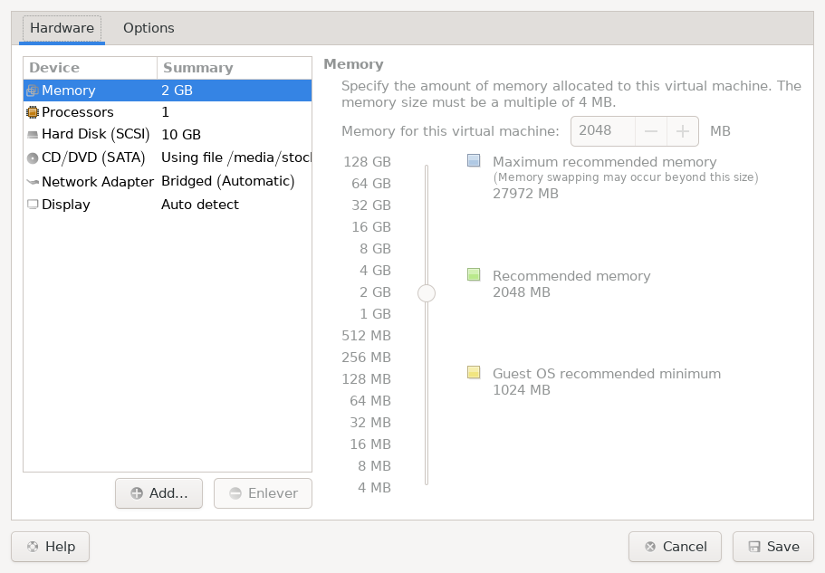
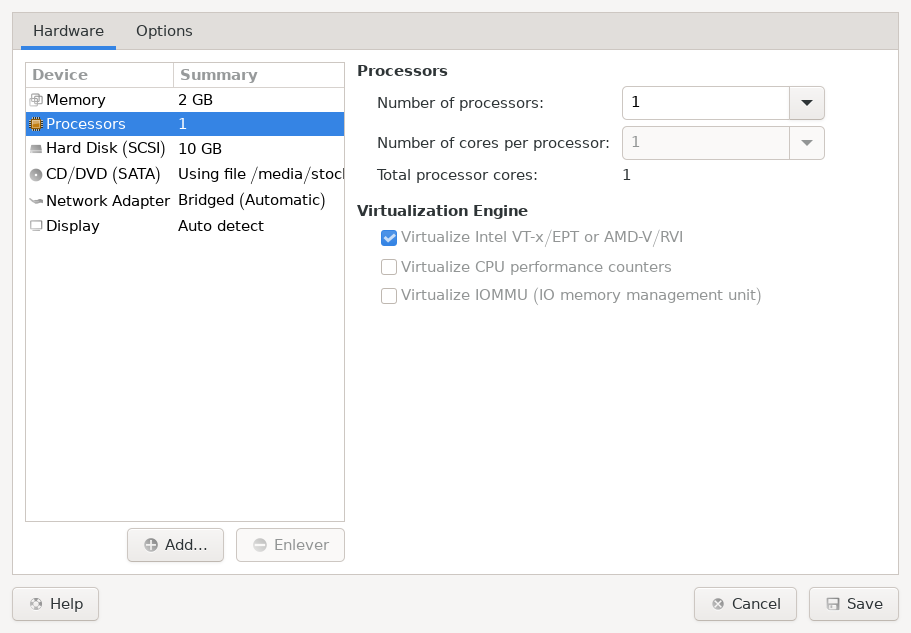
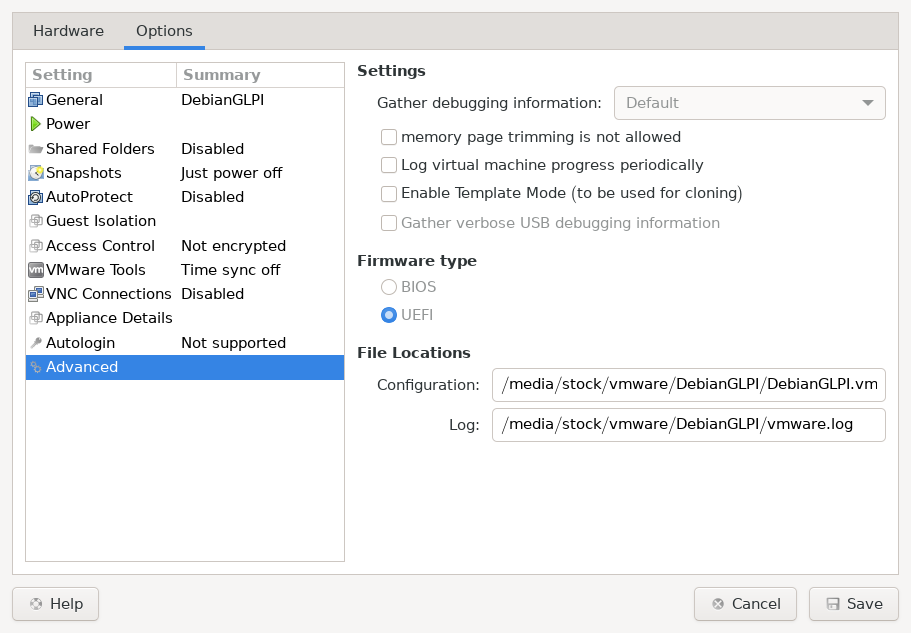

### 0 - Sources
[Atelier : LAMP + GLPI](https://github.com/O-clock-Volva/S05-atelier-LAMP/blob/master/README.md)

[glpi](https://github.com/glpi-project/glpi/releases/)

[Installation pas-à-pas de GLPI 10 sur Debian 12](https://github.com/glpi-project/glpi/releases/)

[Apache configuration](https://glpi-install.readthedocs.io/fr/latest/prerequisites.html#apache-configuration)

[Timezones mysql](https://glpi-install.readthedocs.io/fr/latest/timezones.html)

[PHP : ajouter les directives “HttpOnly” et “Secure” aux cookies de session](https://glpi-install.readthedocs.io/fr/latest/timezones.html)

[php](https://www.php.net/manual/fr/session.configuration.php)


### 1 - Debian
    ISO : Debian 12.8.0 Net Install (disponible sur le drive)
    2048 MB de RAM
    1 CPU
    10 Gio de disque dur

#### Configuration VMware



```
cat > /etc/apt/apt.conf.d/90_recommends << EOF
APT::Install-Recommends "false";
EOF
apt update
apt install sudo vim
usermod -aG sudo <nom_utilisateur>
```
> [!WARNING]
> **Remplacez <nom_utilisateur> par le nom de votre utilisateur !**

```
vim /etc/network/interfaces
   allow-hotplug ens32
   iface ens32 inet static
      address 192.168.0.51/24
      gateway 192.168.0.1
      dns-nameservers 1.1.1.1 192.168.0.1

systemctl restart networking.service
ip a
```
> [!NOTE]
> Se connecter en ssh
--------------
> [!NOTE]
> si installé sur vBox :
> 
> désactivez l'installation automatique (il faut cocher la case Skip unattended installation)
> 
> laissez la case Enable EFI décochée
> 
>```
>sudo apt update
>sudo apt install build-essential dkms linux-headers-$(uname -r)
>sudo mount /dev/cdrom /mnt
>cd /mnt
>sudo ./VBoxLinuxAdditions.run
>```
--------------
### 2 - Apache / MariaDB
- Apache
```
sudo apt install apache2
systemctl status apache2
```
- MariaDB
```
sudo apt install mariadb-server
sudo mysql_secure_installation

   Enter current password for root (enter for none): 
   Switch to unix_socket authentication [Y/n] Y
   Change the root password? [Y/n] Y
   New password:
   Re-enter new password:
   Password updated successfully!
   Remove anonymous users? [Y/n] Y
   Disallow root login remotely? [Y/n] Y
   Remove test database and access to it? [Y/n] Y
   Reload privilege tables now? [Y/n] Y

mysql -u root -p

   CREATE USER 'dbuser'@'localhost' IDENTIFIED BY 'VotreMotDePasse';
   GRANT ALL PRIVILEGES ON *.* TO 'dbuser'@'localhost' WITH GRANT OPTION;
   FLUSH PRIVILEGES;
   exit
```

### 3 - PHP

```
sudo apt install php libapache2-mod-php
sudo apt install php-{curl,gd,intl,memcache,xml,zip,mbstring,json,mysql,bz2,ldap}
sudo systemctl restart apache2
echo "<?php phpinfo(); ?>" | sudo tee -a /var/www/html/info.php
```

### 4 - GLPI

```
cd ~
wget https://github.com/glpi-project/glpi/releases/download/10.0.17/glpi-10.0.17.tgz
sudo tar -xvf glpi-10.0.17.tgz -C /var/www/html
```
```
sudo chown -R $USER:www-data /var/www/html
sudo chmod 770 -R /var/www/html
```

### 5 - PHPMyAdmin

```
sudo apt install phpmyadmin
```

### 6 - Sécurisation GLPI
- Changement mdp

- suppression des fichiers et dossiers d'installation
```
sudo rm -r /var/www/html/glpi/install
```
- Le répertoire /etc/glpi
```
sudo mkdir /etc/glpi
sudo chown www-data /etc/glpi/
sudo mv /var/www/html/glpi/config /etc/glpi
sudo cp /etc/glpi/config/config_db.php /etc/glpi/
```
- Le répertoire /var/lib/glpi
```
sudo mkdir /var/lib/glpi
sudo chown www-data /var/lib/glpi/
sudo mv /var/www/html/glpi/files /var/lib/glpi
```
- Le répertoire /var/log/glpi
```
sudo mkdir /var/log/glpi
sudo chown www-data /var/log/glpi
```
- Créer les fichiers de configuration
```
sudo vim /var/www/html/glpi/inc/downstream.php
   <?php
   define('GLPI_CONFIG_DIR', '/etc/glpi/config/');
   if (file_exists(GLPI_CONFIG_DIR . '/local_define.php')) {
       require_once GLPI_CONFIG_DIR . '/local_define.php';
   }

sudo vim /etc/glpi/config/local_define.php
   <?php
   define('GLPI_VAR_DIR', '/var/lib/glpi/files');
   define('GLPI_LOG_DIR', '/var/log/glpi');
```


```
sudo vim /etc/apache2/sites-available/000-glpi.conf
   <VirtualHost *:80>
      ### ServerName glpi.localhost
      DocumentRoot /var/www/html/glpi/public

      <Directory /var/www/html/glpi/public>
          Require all granted
 
          RewriteEngine On

          RewriteCond %{HTTP:Authorization} ^(.+)$
          RewriteRule .* - [E=HTTP_AUTHORIZATION:%{HTTP:Authorization}]

          RewriteCond %{REQUEST_FILENAME} !-f
          RewriteRule ^(.*)$ index.php [QSA,L]
      </Directory>
   </VirtualHost>

sudo vim /var/www/html/glpi/.htaccess
   RewriteBase /
   RewriteEngine On
   RewriteCond %{REQUEST_URI} !^/public
   RewriteRule ^(.*)$ public/index.php [QSA,L]

sudo a2ensite 000-default.conf
sudo a2enmod rewrite
```
- cookie_httponly
```
COOKIES=$(sudo grep -r "session.cookie_httponly" /etc); for i in "$COOKIES"; do sudo sed -i 's/.*session.cookie_httponly.*/session.cookie_httponly = on/' $(echo "$COOKIES" | awk -F ":" '{print $1}');done

sudo systemctl restart apache2
```

- Correction Timezones
```
mysql_tzinfo_to_sql /usr/share/zoneinfo | mysql -p -u root mysql
```


