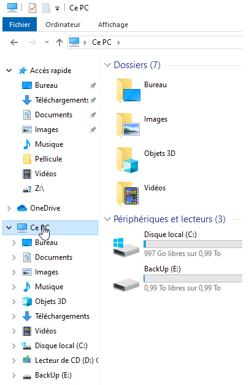

> Monsieur Roger, un photographe particulièrement stressé, t’a envoyé un email urgent :

    Bonjour,

    C’est la panique ! J’ai essayé de changer mon mot de passe et maintenant je ne peux plus accéder à mon ordinateur ! C’est vraiment problématique, j’ai des livraisons à faire et, en plus, mon réseau ne fonctionne plus… je ne sais plus quoi faire !

    Mes photos, elles sont toutes dans mon dossier « Images » et je dois absolument m’assurer qu’elles sont sauvegardées, c’est crucial !

    Je te demande de l’aide. Peux-tu, s’il te plaît, vérifier que tout est en ordre, créer un point de restauration au cas où, et t’assurer que je ne perds rien ? J’ai entendu parler de Recuva, tu pourrais peut-être l’utiliser pour récupérer ce qui a disparu ?

    Merci infiniment pour ton aide. Je suis vraiment à bout !

Ta mission est de calmer la situation et de diagnostiquer puis résoudre les problèmes rencontrés par Monsieur Roger en suivant ces étapes :

    Résoudre le problème de connexion (mot de passe),
    Réparer le périphérique réseau,
    Récupérer les images perdues avec Recuva,
    Ajouter l’historique de fichier pour le dossier « Images »,
    Créer un point de restauration.

#### Étape 1 : Incident : Résoudre le problème de connexion (mot de passe)

Boot sur Hiren's BootCD


- Utilisation de **Windows Login Unlocker**


- Suppression du mot de passe


> [!NOTE pour M Roger]
> Pour définir le mot de passe :
> Appuyer sur **CTRL + ALT + SUPPR**, puis cliquer sur **Modifier le mot de passe**


> [!WARNING]
> On s'occupe tout de suite de l'étape 3 avec les outils de Hiren's BootCD

#### Étape 2 : Incident : Réparer le périphérique réseau


- Vérification de l'état de la carte réseau 


- Utilisation de l'outil de résolution de problèmes Windows


- Vérification du bon fonctionnement en faisant un ping de google.fr depuis une console CMD


> [!TIP]
> Autres possibilitées :
> - **Executer > ncpa.cpl** pour ouvrir les Connexions réseau, et activer la carte 


> - En console PowerShell Administrateur : 
```
Get-NetAdaptater
Enable-NetAdaptater -Name "Ethernet"
```


#### Étape 3 : Incident : Récupérer les images perdues avec Recuva

- Utilisation de Recuva pour récupérer des fichiers :


------
> [!WARNING]
> Pour les étapes 4 et 5 il serait bien d'installer un nouveau disque,
> ou de mettre en place une solution avec un disque dure extèrne ou un NAS.

#### Étape 4 : Demande : Ajouter l’historique de fichiers pour le dossier « Images »

- Ajout d'un nouveau disque : Activation et Formatage


- Activation de l’historique de fichiers :
> aller dans	**Paramètres > Système > Stockage >> Afficher les options de sauvegarde**
> ou dans 	**Paramètres > Mise à jour et sécurité > Sauvegarde de fichiers**


> Ajouter un lecteur


> Selectionner les dossiers à sauvegarder et activer la sauvegarde


> [!NOTE pour M Roger]
> L'**Historique de fichiers** va permettre de sauvegarder régulièrement les dossiers sélectionnés.
> Pour les restaurer : Ouvrir l'**Explorateur de fichiers**


> Selectionner **Ce PC**



> Cliquer sur le petit *Chevron* à coté de **Ce PC** et sélectionner **Panneau de configuration**


> Dans **Système et sécurité** cliquer sur **Enregistrer des copies de sauvegarde de vos fichiers...**


> Selectionner **Restaurer des fichiers personnels**


#### Étape 5 : Demande : Créer un point de restauration

- Création d’un point de restauration système :
> Dans **Paramètres** > **Système** > **À propos de** sélectionner **Paramètres avancés du système** > onglet **Protection du système** > **Créer...**


#### Cloture de la réparation du PC de M Roger 

