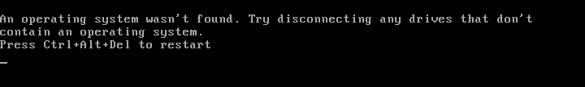

# Réparation du Pc de Mme Michu



## Étape 1 : Réparer le démarrage de Windows

   - utilisation d'un cd **Windows 10** pour lancer les outils de diag
   - Choisir **Réparer l'ordinateur** à la deuxième fenêtre de l'installateur.


  - Choisir **Windows 10** dans la fenêtre qui s'affiche et laisser le Diagnostique se agir.
  - Le Pc redémarrera tout seul, on peut retirer le cd **Windows 10**

**Toujours une erreur au démarrage**


   - Éteindre le pc et le redémarrer

**Le pc redémarre sur le diagnostique et réparation mais toujours pas d'accès à Windows.**

On nous dit :

> **Problème rencontré** : L’ordinateur de Madame Michu refuse de démarrer correctement, avec des messages tels que « BootMGR est manquant » **ET** « Winload.exe introuvable »

   - vérification de la présence de ** winload.exe ** avec l'aide de la console
   


    dir /s e:\Windows\System32\winload.*


**On peut voir que le fichier *e:\\Windows\\System32\\winload.exe* "n'existe pas", l'extension du fichier ayant été modifié.**

**Deux solutions : le Renommer ou le copier**

   - le Renommer :

```
e:
cd Windows\System32
ren winload.panne winload.exe
```

  - Le copier
	
```
e:
cd Windows\System32
copy Boot\winload.exe winload.exe
```

***
>	**Correction**
>
>	utilisation de la commande **sfc**
>
>	voir : [SFC parle CrabeInfo](https://lecrabeinfo.net/sfc-exe-reparer-windows-avec-verificateur-des-fichiers-systeme.html)

***


**Redémarrage de la machine et arrivé sur le bureau de Mme Michu, le Boot est réparé.**

***
## Étape 2 : Restaurer les performances normales de la machine

Arrivé sur session de Mme Michu, on peut percevoir des lenteurs


Au lancement du gestionnaire de tâches on peut voir le Processeur et la RAM à 100%


Il y a un nombre anormal de processus identique de lancé (*Commande TCP/IP Ping* et *Hôte de la fenêtre de la console*)


il y a une commande étrange dans l'onglet **Démarrage** => *Windows PowerShell*

lancement de la console en mode administrateur


	`tasklist`

permet de voir que PING.EXE se lance en boucle

	`taskkil /F /IM PING.EXE`

Tuer les tache de PING.EXE permet de revenir à une charge normal de processeur

   - recherche des causes :
   
   si on regarde dans le dossier **`\C:\Users\Mme Michu\AppData\Roaming\Microsoft\Windows\Start Menu\Programs\Startup`** on peut voir un petit raccourcis appelé **Ping**

   

En suivant les traces on arrive à un petit script en Shell sous `C:\Windows\Ping.ps1`

```
for ($i = 0; $i -lt 500; $i++) {
    Start-Process "ping" -ArgumentList "google.com -t" -WindowStyle Hidden
}
```

Donc plusieurs solutions / action :

   - Désactiver **Windows PowerShell** dans le Gestionnaire de Démarrage
   - supprimer le raccourcis **Ping** dans le dossier *Startup* de Mm Michu
   - renommer le fichier **Ping.ps1** en **Ping.COUPABLE** depuis une console administrateur
   
***
## Étape 3 : Vérifier l’état des disques durs

Ouverture de **Gestion des disques** dans le menu système


ce qui saute aux yeux c'est le **disque 1** de 10 Go hors connexion

deux solutions :

   - en mode graphique, clique droit sur **Disque 1** (ou il y a la petite flèche vers le bas) => choisir **En ligne**
   - en ligne de commande avec **DISKPART**


On profite d'être en liqne de commande pour lancer des vérification des disques 


***
## Étape 4 : Retrouver les fichiers disparus dans le dossier « Images »

Accéder aux sauvegardes de l’Historique des fichiers sous Windows 10

- Cliquez sur **Démarrer** -> **Paramètres** ou appuyez sur le raccourci clavier *`Windows + I`* pour ouvrir les paramètres de Windows


- **Mise à jour et sécurité**
- **Sauvegarde** dans la colonne de gauche
- cliquez sur le lien **Plus d’options** sous ***Sauvegarder en utilisant l’historique des fichiers***.
- Dans la fenêtre pop-up, cliquez sur le lien **Restaurer les fichiers depuis une sauvegarde en cours** pour accéder à la fenêtre des sauvegardes de l’historique des fichiers.
- Sélectionner **Images** et cliquer sur le "bouton vert" de restauration


***
# Remise en état du pc de Mme Michu terminée
