### OPNsense

- [OPNsense](https://opnsense.org/)
- [OPNsense - Download](https://opnsense.org/download/)
- [OPNsense - Starter guide](https://opnsense.org/users/get-started/)
- [OPNsense - Manuel](https://docs.opnsense.org/manual/hardware.html)

#### Création de la vm proxmox

1. Création d'une nouveau Bridge réseau vmbr4 qui sera utiliser pour connecter la machine OPNsense au réseau LAN

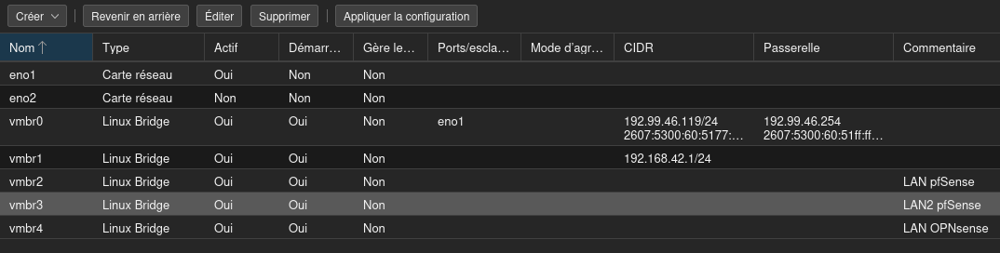

2. Création de la vm
	
  * 1 cœur / 1 CPU
  * 2 Go de RAM
  * Bridge sur vmbr1

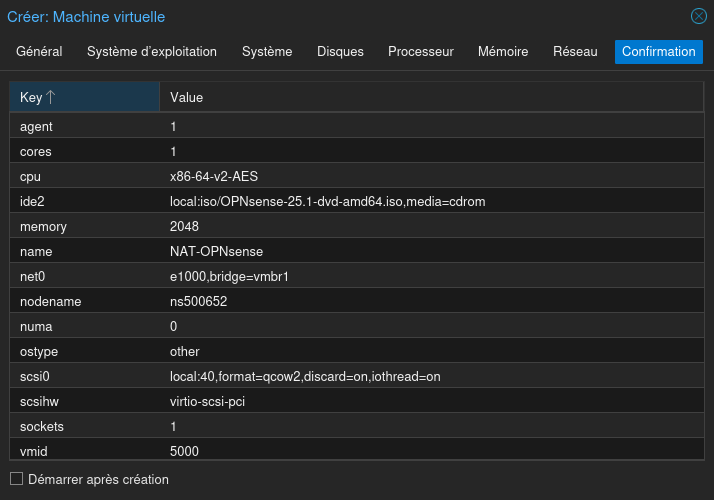

3. Ajout d'une carte réseau, la vmbr4

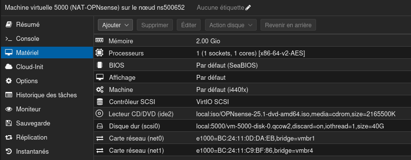

#### Installation

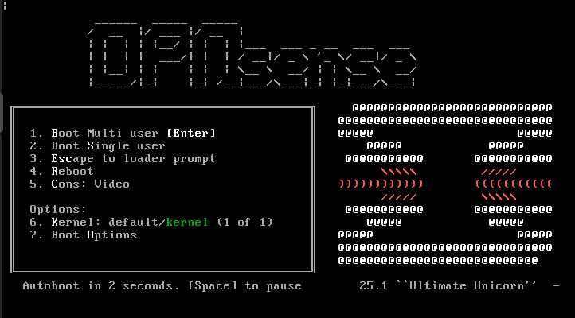

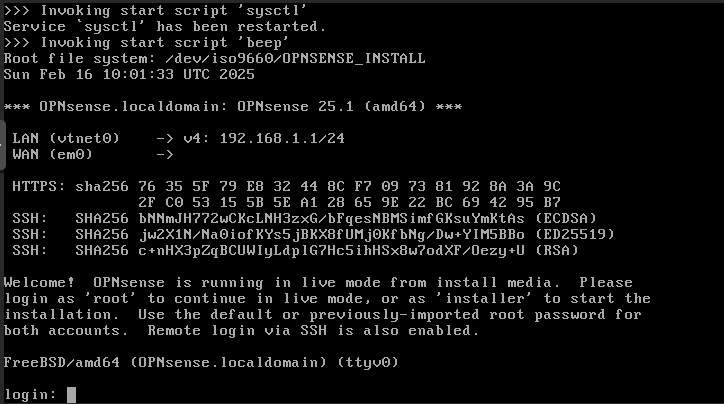

Pour la première connexion et l'installation

  * Login : **installer**
  * mot de passe : **opnsense**

> [!WARNING]
> le clavier est en **QWERTY** pour le moment

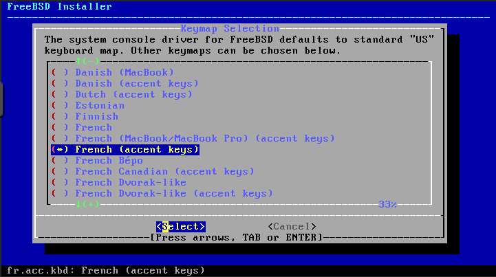

Choix du type d'action à effectuer. 
Sélection de l'installation en utilisant UFS

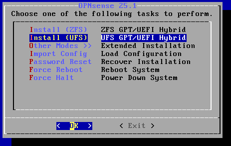

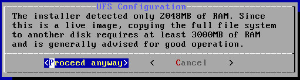

Sélection et préparation du disque.

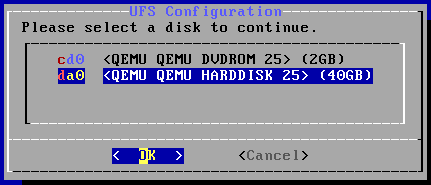

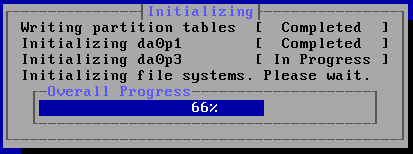

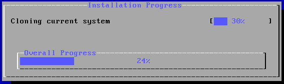

Définition du mot de passe root

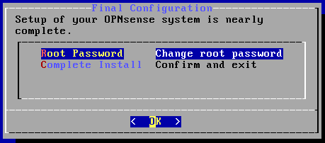

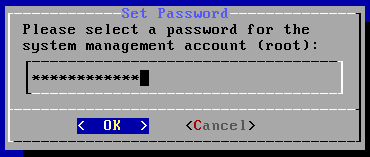

Reboot pour finaliser l'installation.

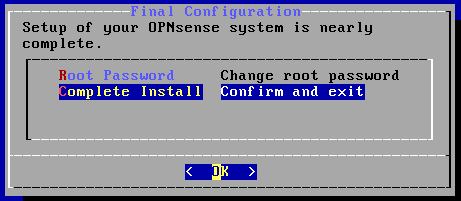

#### Configuration du réseau

OPNsense est maintenant installé mais pas encore connecté.

1. Assignation des interfaces réseau

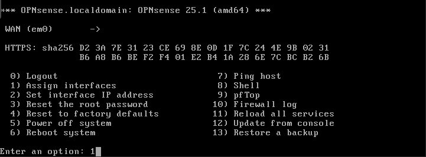

On récupère les adresses MAC pour assigner les cartes sur le LAN et le WAN

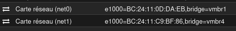

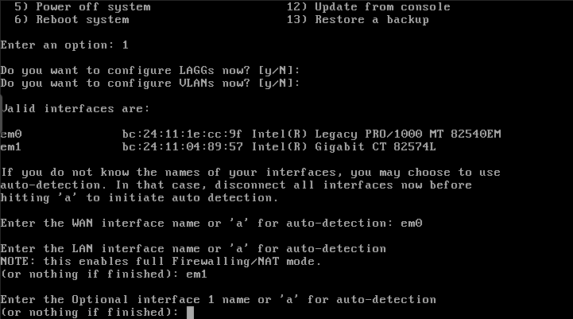

  * vmbr1 -> WAN -> em0
  * vmbr4 -> LAN -> em1

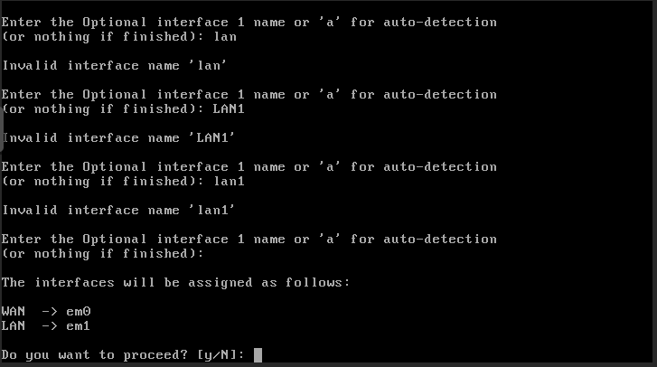

2. Configuration des interfaces

  * WAN
	- Static
	- 192.168.42.111/24
	- passerelle : 192.168.42.1 (vmbr1)
		
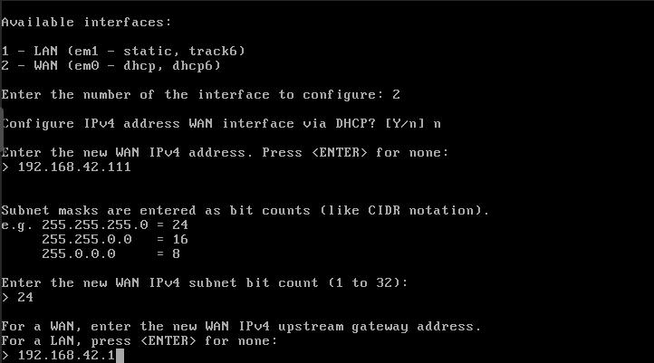

  * LAN
	- Static
	- 10.0.0.1/16
	- pas de passerelle
	- activation du DHCP
	- plage de DHCP : 10.0.0.100 - 10.0.0.150

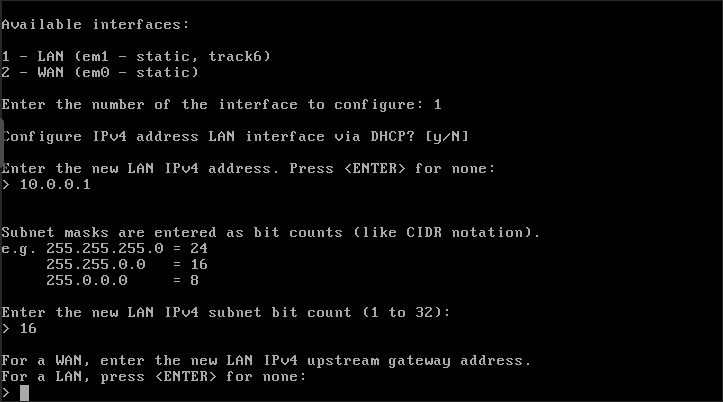

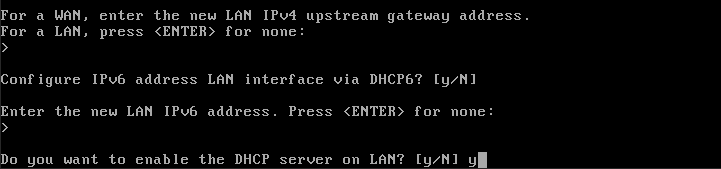

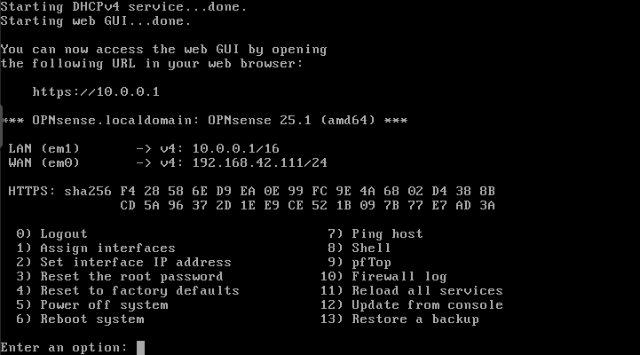

OPNsense est maintenant installer, on peut s'y connecter via le navigateur d'une machine sur le réseau.

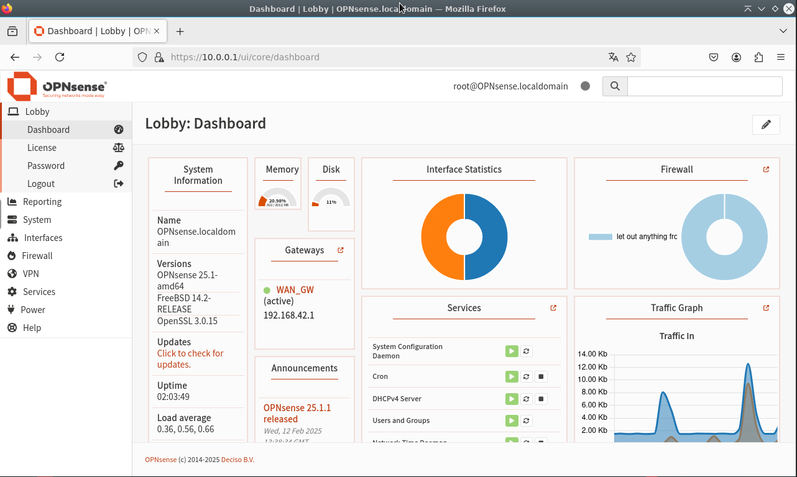

