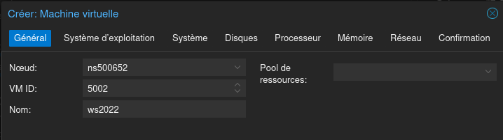
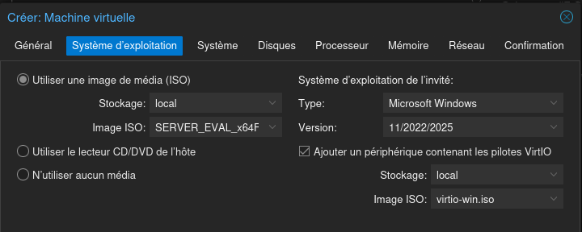
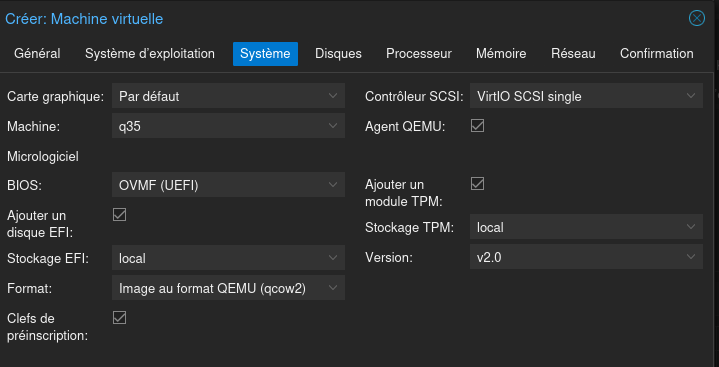
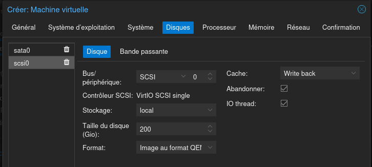
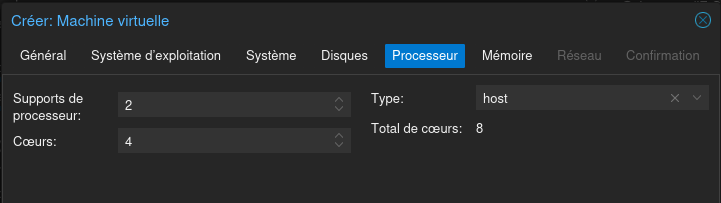
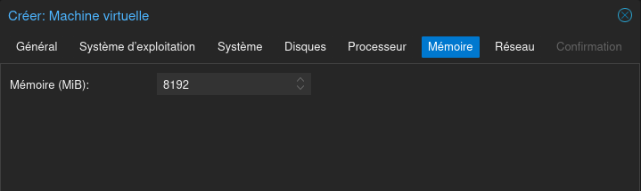
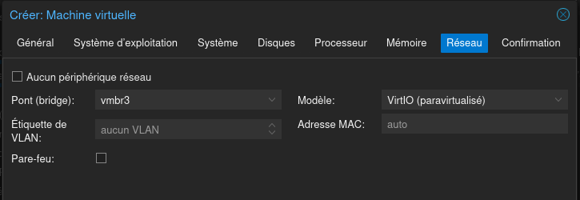

### Installation de Windows Serveur 2022 

#### vm proxmox

- Système d'exploitation :

> [!NOTE]
> Bien pense à cocher `Ajouter un périphérique` pour y insérer l'ISO des drivers VirtIO  

- Système

- Disques

> [!NOTE]
> En prévision des rôle j'ai ajouté un disque

- Processeur

- Mémoire

- Réseau

> [!NOTE]
> Pour mon projet j'ai mis le serveur sur le LAN2 (carte vmbr3) 

#### Installation de Windows Serveur

- Démarrage bien penser à activer la console Proxmox pour "Appuyer sur une touche"

- Choix du système d'exploitation 

> [!NOTE]
> `Avec Experience de bureau` si on veut un serveur avec une interface Windows
> Sinon sans ce sera un serveur dit `Nano` à gérer à distance soit en SSH soit avec WAC ([Windows Admin Center](https://www.microsoft.com/en-ca/windows-server/windows-admin-center))

- Pilote 

> [!NOTE]
> Ajouter les piotes VirtIO pour les disques (**vioscsi**) et la carte réseau (**NetKVM**)

 

