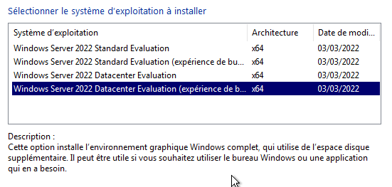
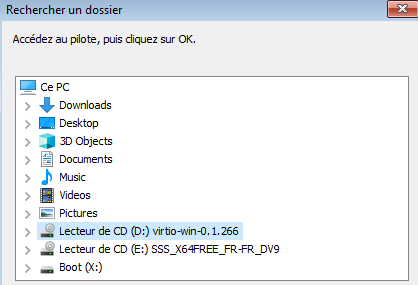
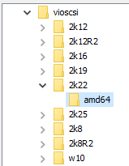

### Installation de Windows Serveur 2022 

#### vm proxmox

> [!NOTE]
> #### La Machine Virtuelle :
> 1. Iso Windows Serveur + Iso virtio-win pour les drivers
> 2. 2 Disque de 200 Go SCSI / Write back
> 3. 2 Supports de Processeur / 4 Cœurs de type host
> 4. 8192 Mib de RAM

#### Installation de Windows Serveur

- Démarrage bien penser à activer la console Proxmox pour "Appuyer sur une touche"

- Choix du système d'exploitation 

> [!NOTE]
> Avec `Experience de bureau` si on veut un serveur avec une interface Windows.
> 
> Sinon sans ce sera un serveur dit `Nano` à gérer à distance soit en SSH soit avec WAC ([Windows Admin Center](https://www.microsoft.com/en-ca/windows-server/windows-admin-center))

- Pilotes

> [!NOTE]
> Ajouter les pilotes VirtIO pour les disques (**vioscsi**) et la carte réseau (**NetKVM**)

 

