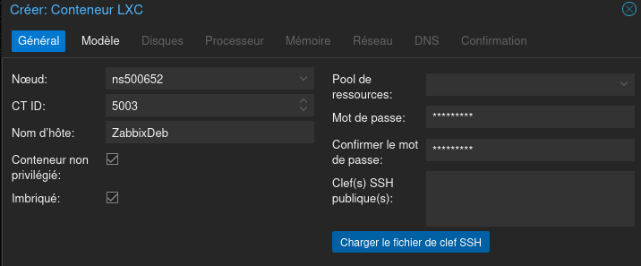
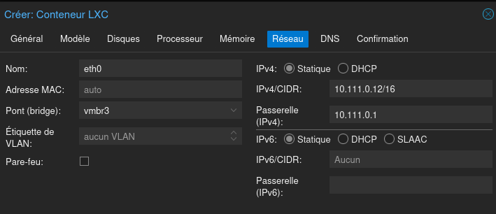
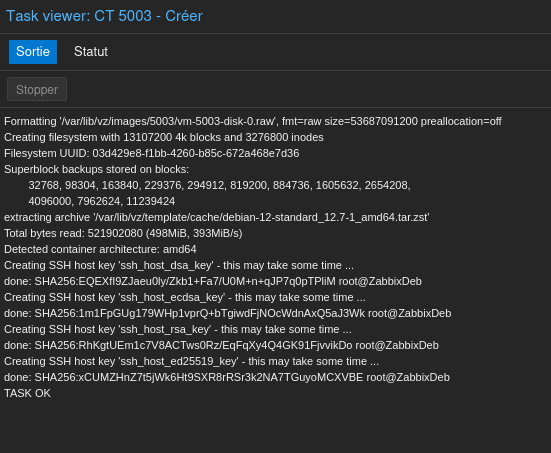

### Installation de zabbix sur CT debian12

#### Création du conteneur Debian
 



- Choix du réseau / DNS : 

	- Choix de vmbr3 pour le bridge (réseau LAN2 de la pfsense) 
	- Static : definir IP/cidr et passerelle (10.111.0.1 pour la pfsense) en DNS on met l'adresse de la pfsense
	- en DHCP on laisse tout par defaut, on ne met rien dans le DNS
	





- Mise à jour du conteneur

```
apt update && apt upgrade
```
> [!WARNING]
> L'utilisation du SSH avec le compte root est déconseillé
>
> #### Instalation de vim et activation de SSH pour root
> ```
> apt install vim
> vim /etc/ssh/sshd.config
> ```
> 
> > [!NOTE]
> > Remplacer `#PermitRootLogin prohibit-password` par `PermitRootLogin yes`
> 
> ```
> systemctl restart sshd
> ```

#### Création d'un utilisateur 

```
apt install sudo vim
mkdir /home/NomUtilisateur
useradd -d /home/NomUtilisateur -G sudo -s /bin/bash NomUtilisateur
```

#### Installation de Zabbix 

- [Zabbix](https://www.zabbix.com/fr/download)
> [!NOTE]
> Sur le site de Zabbix, selectionner la Version, la Distribution, l'OS, les composants Zabbix, le base de données et le serveur web.


```
wget https://repo.zabbix.com/zabbix/7.2/release/debian/pool/main/z/zabbix-release/zabbix-release_latest_7.2+debian12_all.deb
dpkg -i zabbix-release_latest_7.2+debian12_all.deb
apt update

apt install zabbix-server-mysql zabbix-frontend-php zabbix-apache-conf zabbix-sql-scripts zabbix-agent
```
> [!WARNING]
> Installer la base de donnée

- Installation de Mariadb

```
apt install mariadb-server

mysql_secure_installation

   Enter current password for root (enter for none): 
   Switch to unix_socket authentication [Y/n] Y
   Change the root password? [Y/n] Y
   New password:
   Re-enter new password:
   Password updated successfully!
   Remove anonymous users? [Y/n] Y
   Disallow root login remotely? [Y/n] Y
   Remove test database and access to it? [Y/n] Y
   Reload privilege tables now? [Y/n] Y
```

- Création de la base de données et de l'utilisateur

```
mysql -u root -p
```
> [!WARNING]
> Les commandes suivantes sont à entrer dans un terminal sous `MariaDB [(none)]>`
> et changer `<password>` par votre mot de passe
```
create database zabbix character set utf8mb4 collate utf8mb4_bin;
create user zabbix@localhost identified by <password>;
grant all privileges on zabbix.* to zabbix@localhost;
set global log_bin_trust_function_creators = 1;
quit;
```

- on verifie le status de Mariadb

```
systemctl status mariadb.service
```

- Installation adminer

```
apt install adminer
a2enconf adminer
systemctl reload apache2
```

- Configuration des locales

```
dpkg-reconfigure locales
```
> [!NOTE]
> Sélectionner les `fr_FR` et `en_US`


- Importation de la bd zabbix

```
zcat /usr/share/zabbix/sql-scripts/mysql/server.sql.gz | mysql --default-character-set=utf8mb4 -uzabbix -p zabbix
```

première connextion Zabbix
[ Admin / zabbix ]

